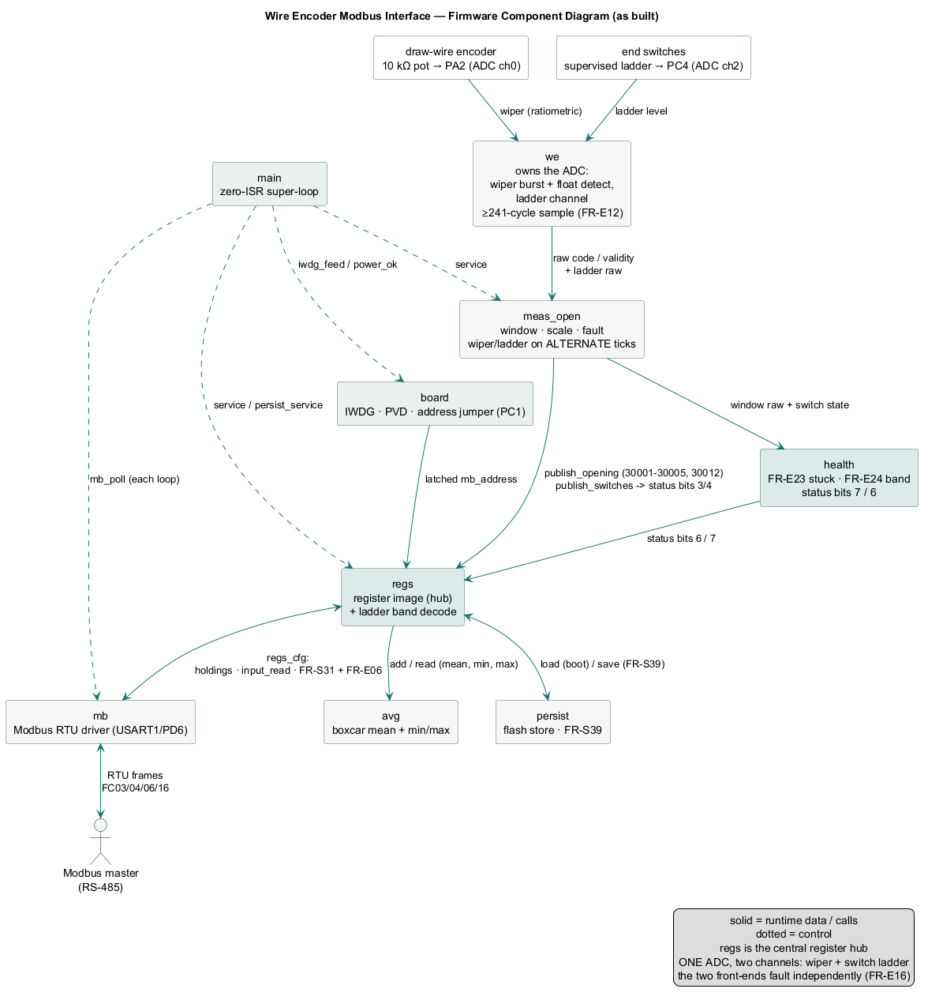
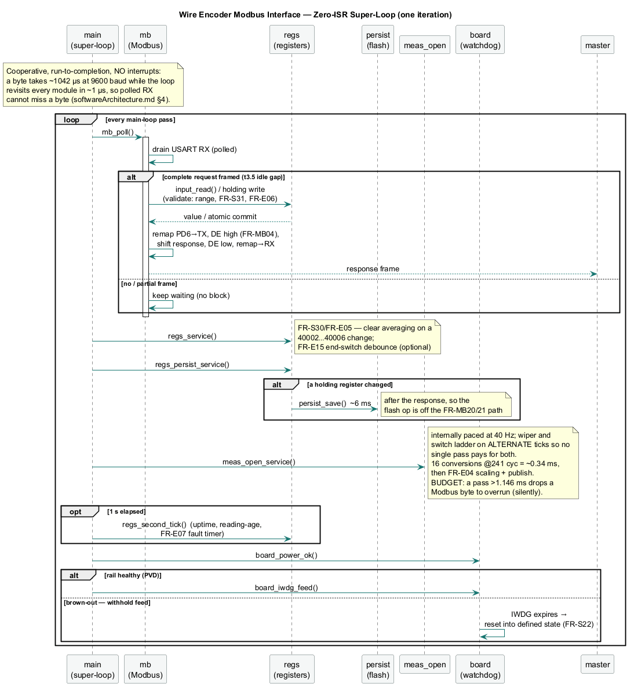
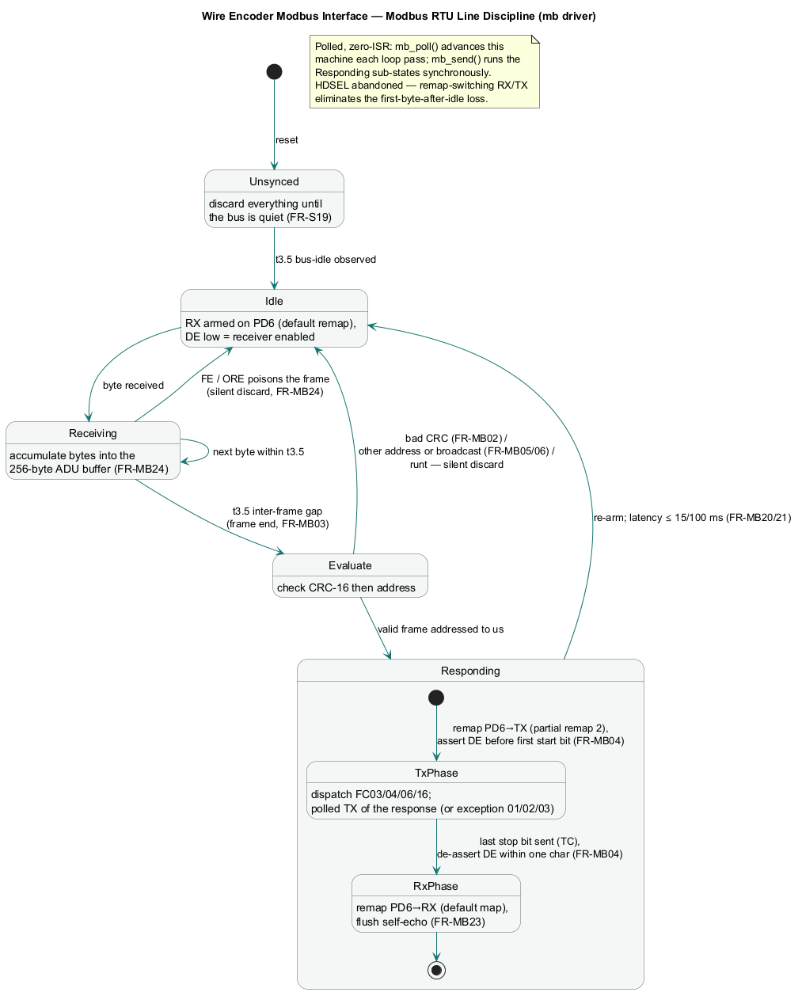

# Software Architecture — Wire Encoder Modbus Interface

| Field | Value |
|---|---|
| Document | Software architecture (design rationale) |
| Project | `wire-encoder-modbus-interface` firmware |
| Date | 2026-07-28 |
| Status | **Inherited baseline, adopted as-is for the Modbus/platform half; the measurement half is a plan.** The zero-ISR super-loop, the module split and the sizing method come from the sibling `windmeters-modbus-interface` project, where they are implemented and HIL-verified on the same MCU. Everything below marked *planned* has not been built here. |
| Related docs | `design/TDS.md` v0.4 (requirements this design satisfies), `design/driverDevelopment.md` (the encoder driver is written against this architecture), `design/integrationPlan.md`, `design/scratchBook.md`; sibling project's `design/softwareArchitecture.md` (the source of §1, §3, §4) |

## 1. Scope and constraints

Target: CH32V003J4M6 — RV32EC, one core, 48 MHz HSI, 16 KB flash, 2 KB SRAM.
The device measures window opening from a draw-wire encoder's 10 kΩ
potentiometer on PA2 (TDS §1.1).

**One build.** Unlike the sibling project, which compiles three sensor
variants from one tree, there is one sensor read one way — so there is no
build selector and no capability macro. The only compile-time option is
`TEST_HOOKS` (bench-only), off by default.

**One ADC, two channels.** The wiper is channel 0 on PA2; the two
end-of-travel switches share channel 2 on PC4 through a supervised resistor
ladder (TDS §4.4). The switches are part of the product, not an option.

Given these constraints and the TDS requirements, the architecture is
**zero-interrupt: a cooperative super-loop polls everything.** No RTOS —
it would cost more RAM than the application uses and buys nothing here.

> **Inherited amendment (sibling project, 2026-07-03 phase-3 bench):** the
> original design used a USART RX ISR + SysTick ISR. On the bench, the RXNE
> ISR corrupted ~1/3 of received frames (missing/scrambled leading bytes,
> no USART error flags, wire verified pristine) — symptoms consistent with
> interrupt prologue/state corruption on this RV32EC toolchain path. Polled
> RX fixed it completely (26/26 matrix + 40/40 endurance). Since the main
> loop cycles in ~1 µs versus 1042 µs per byte at 9600 baud, polling is
> provably lossless and interrupts buy nothing. **Do not introduce ISRs in
> this project without first root-causing that failure** (suspect
> `__attribute__((interrupt))` code generation with ch32v003fun). This
> applies here unchanged — same core, same toolchain, same driver binary.

## 2. Structure

```
┌─ main loop (everything, run-to-completion, no ISRs) ────────┐
│ for(;;) {                                                   │
│   modbus_service();      // poll RXNE/errors, stamp ticks,  │
│                          // gap detect, parse, respond      │
│   opening_service();     // PLANNED: 16-conversion ADC      │
│                          // burst, scale, publish on        │
│                          // window close                    │
│   diagnostics_service(); // uptime, counters                 │
│   IWDG_refresh();        // only here (FR-S20)              │
│ }                                                           │
└─────────────────────────────────────────────────────────────┘
   No hardware counter needed: the potentiometer is ABSOLUTE, so
   there is nothing to accumulate between samples.
   Timing: raw SysTick->CNT arithmetic (HCLK; FUNCONF_SYSTICK_USE_HCLK 1)
```

Initialization before the loop follows the FR-S18 order strictly:
PC2/DE low first → PC1 address latch → sensor front-end ready (one ADC
self-calibration covering both channels) → IWDG on → USART1 receiver enabled
last.

**Current state (2026-09-05):** all modules are in the tree, built and
HIL-verified — integration stages A–F are complete. The measurement service
runs at 40 Hz, and the wiper and the switch ladder are serviced on
**alternate ticks** so that no single loop pass pays for both. That is not a
style choice: see the blocking budget in §5.

*See §7 for the component, super-loop sequence, and Modbus state-machine
diagrams.*

## 3. Key decisions and why

The first three are inherited verbatim and are not up for renegotiation
without bench evidence; the last two are specific to this device.

**Everything stateful lives in the main loop.** Modbus registers are written
by the measurement service and read by the Modbus service — both in the same
sequential loop, so FR-S24's snapshot coherence is *structural*: no masking,
no double-buffering, no races, because there is no preemption between
producer and consumer. This is the single biggest simplification available.

**Frame boundary by polling, not a timer.** The main loop checks
`ms_tick - last_rx_tick ≥ 5` to detect the 3.5-character gap (FR-MB03). A
dedicated t3.5 timer interrupt is the textbook approach, but the loop
iterates thousands of times per millisecond and the detection jitter this
adds is microseconds against a 100 ms budget (FR-MB20).

**Blocking TX from the main loop.** The longest response (~29 bytes) takes
~33 ms of wire time at 9600 baud. Sending it byte-by-byte with a poll on
TXE, then polling TC to drop DE within one character time (FR-MB04), is
simple and deterministic. Self-echo cannot occur: the remap-switching line
discipline (RX native on PD6; TX remapped onto PD6 only for the response,
RO tri-stated while DE is high — HDSEL was abandoned per the §1 amendment)
leaves nothing looped back, and the receiver re-arms only after DE drops
plus a t3.5 idle (FR-MB23).

**An absolute sensor removes the accumulator — and the timer.** The sibling
project's speed path needed TIM2 counting continuously in hardware because
pulses arrive whether or not firmware is looking. A potentiometer carries
the window's position in the sensor: a sample taken now is complete in
itself. Consequences — no timer peripheral is claimed, the measurement
window is purely a *publishing* cadence rather than an accumulation
interval, and FR-E01's "correct immediately after reset, no homing" falls
out for free. The window still matters (it paces averaging and bounds the
FR-E10 rate estimate), but a missed window costs one sample, not a
reference.

**Nothing in this firmware blocks for long.** The ADC burst — 16
conversions at the ≥241-cycle sample time, plus one on the switch ladder —
totals ~0.36 ms, and the FR-E15 switch debounce is a comparison
against a SysTick stamp, not a delay: a candidate state simply has to survive
20 ms of calls. The only meaningful blocking operations are the ~33 ms
response TX and the ~6 ms flash commit, both inherited, both deliberately
outside the FR-MB20/21 latency path or well inside it. This is worth stating
because it is what a future feature must not break.

## 4. Shared state — the complete list

With zero interrupts there is **no concurrency surface at all**: every
variable has exactly one execution context. The RX buffer, tick stamps,
register image, debounce state, and averaging blocks are all plain
main-loop state. FR-S24's snapshot coherence is absolute by construction.

## 5. Sizing sanity check

**RAM:** 256 B RX + 64 B TX + ~32 B register image + ~384 B averaging blocks
(64 entries × u16 for the mean, plus the FR-E08 min/max blocks) + ~512 B
stack ≈ **1.25 KB**, inside NFR-RES01's 1792 B ceiling.

**Flash:** Modbus core ~2–3 KB, bitwise CRC-16 (~100 B — speed is
irrelevant at 9600 baud), measurement + scaling logic ~1 KB, persistence
~600 B. Comfortably inside NFR-RES01's 14 336 B ceiling, and materially
cheaper than the sibling project's largest build, which spent ~1 KB on a
sin/cos table and CORDIC `atan2` for a circular mean — **the opening is a
scalar, so none of that is needed here.** (Note: RV32EC has no hardware
multiply/divide; libgcc soft routines are pulled in by the FR-E04 math.)

**Latency:** response starts ~5 ms after the frame gap in the sibling
project's measured typical case, and this firmware's loop is strictly
lighter. Meets FR-MB21's 95%-within-15 ms with margin, and FR-MB20's 100 ms
hard limit trivially.

**As-built (stages A–F complete, measured 2026-09-05):** release build
**6 364 B flash (44.4 %) / 1 108 B RAM (61.8 %)**. RAM is the tighter of the
two — `avg.c`'s ring is ~384 B of it — with ~684 B of headroom left.

**The blocking budget — the constraint no requirement states.** `mb_rx_service`
polls a single-byte USART register, so any loop pass longer than **one
character time (1.146 ms at 9600)** loses a byte to overrun. FR-MB24 then
discards the frame **without** incrementing 30009, because an overrun is not a
CRC error — so the request vanishes leaving no trace in any counter. Stage D
dropped **9.7 %** of requests before this was understood. Any work added to the
loop must be costed against the *pass* time, not the measurement window.

## 6. Module split

| Module | Contents | State |
|---|---|---|
| `main.c` | The super-loop and window pacing | **in tree** |
| `board.c` | Clocks, GPIO, FR-S18 init order, PC1 address latch, IWDG + PVD | **in tree**, inherited |
| `sensors.h` | Build-type byte and the raw full-scale default; no variant selector | **in tree** |
| `mb.c` | Framing, CRC, FC dispatch, exceptions, DE control + remap-switching line discipline — referenced in place from `software/drivers/modbus_rtu` | **in tree**, inherited, HIL-verified in the sibling project |
| `regs.c` | Register image + table-driven `{addr, min, max}` validator — FR-MB19/22/28 become one code path; the FR-S31 + FR-E06 cross-validate hook; persist load/save wiring; the §4.4 ladder band decode + FR-E15 debounce | **in tree** |
| `scale.c` | FR-E04 two-point opening scaling — direction-agnostic, clamped both ends, tight overflow bound. Deliberately hardware-free so the host test in `software/firmware/test/` exercises the shipped code | **in tree**, host-tested |
| `persist.c` | FR-S39 holding-register persistence — two-page flash ping-pong, power-loss atomic | **in tree**, inherited |
| `meas_open.c` | Window pacing, FR-E04 scaling, FR-E07 fault machine, FR-E10 movement rate. Wiper and ladder on **alternate ticks** (see the blocking budget, §5) | **in tree**, HIL-verified (stage D) |
| `we.c` | Raw-code acquisition: 16-conversion ratiometric ADC burst on the wiper with float detection, plus the PC4 ladder channel. Referenced in place from `software/drivers/wire_encoder`. **Sample time ≥241 cycles (FR-E12), not the sibling project's ≥71** — FR-E21's series resistor raises the source impedance to 12.5 kΩ | **in tree**, HIL-verified |
| `avg.c` | Boxcar/two-stage averaging + FR-E08 min/max tracking (FR-S31). Blocks carry **min/max, not a block mean** — a mean makes the envelope wrong while still looking plausible | **in tree**, 26 host tests (stage E) |
| `health.c` | FR-E23 position-not-following and FR-E24 plausible band — status bits 7 and 6. FR-E24 is **self-disabling** on a full-range calibration, which is what lets it need no persisted "was taught" flag | **in tree**, 25 host tests (stage F) |
| `debug_uart.c` | PD6 TX-only tracing (driver phases only; absent from release builds) | **in tree**, inherited |

Driver development happens standalone per `design/driverDevelopment.md`;
this document is the contract the driver integrates back into.

## 7. Diagrams (UML)

All three diagrams now reflect the **shipped, verified** implementation;
nothing in them is aspirational. Sources live in [`design/diagrams/`](diagrams/) as PlantUML;
regenerate the PNGs with:

```sh
"C:/apps/plantuml/plantuml.exe" -tpng -o . design/diagrams/*.puml
```

### 7.1 Component diagram — module structure & data flow



Source: [`diagrams/component.puml`](diagrams/component.puml). The
potentiometer → `we` → `meas_open` → **`regs` hub** → Modbus pipeline, with
the cross-cutting `main` super-loop and `board` safety services, and the
`avg` / `health` / `persist` satellites off the hub. Solid = runtime
data/calls, dotted = control.

### 7.2 Super-loop sequence — one cooperative iteration (see §2, §3)



Source: [`diagrams/superloop_sequence.puml`](diagrams/superloop_sequence.puml).
One pass of the zero-ISR loop: `mb_poll` (polled RX with the request/response
handled in-line) → `regs_service` → `regs_persist_service` (flash only on a
change, and only after the response) → the measurement service → the
PVD-gated watchdog feed. No interrupts, so there is no concurrency surface.

### 7.3 Modbus RTU line discipline — state machine (see §3)



Source: [`diagrams/modbus_state.puml`](diagrams/modbus_state.puml), carried
over unchanged. The remap-switching RX/TX discipline: unsynced → idle →
receiving → evaluate → `Responding` (Tx-phase / Rx-phase composite) → idle.
HDSEL was abandoned per the amendment in §1; DE timing and t3.5 gaps carry
their FR IDs on the transitions.
