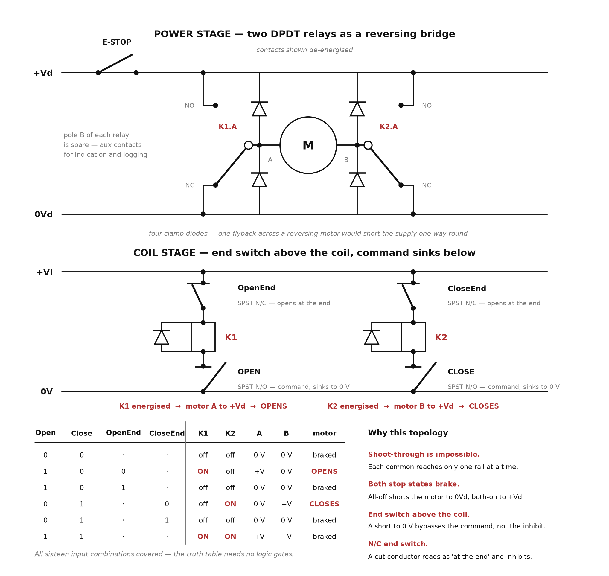

# Window and Window-Controller Emulator — Specification

| | |
|---|---|
| Document    | Window and window-controller emulator |
| Version     | 0.3 (draft — control logic **and its relay realisation accepted** 2026-08-08; mechanical envelope and drive open) |
| Date        | 2026-08-07 |
| Status      | Specification only. Nothing built. §2 and §3 are settled and may be built to; §5 and §8 are not. |
| Scope       | The emulator alone: a carriage that travels, and the controller logic that drives it. Anything mounted **on** the rig for testing is specified by its own documentation, not here. |

---

## 1. What this is

A bench rig that stands in for **a window and the controller that drives it**:
a carriage travelling on a linear axis, driven in two directions by two
potential-free contact inputs, with end-of-travel switches that stop it.

It exists so that equipment which needs a moving window can be exercised
without one — later, as the mechanical half of a hardware-in-the-loop bench.

It is **test equipment, not a product.** It has no enclosure rating to meet,
no service life to speak of, and no interface beyond its two command contacts.

One obligation is easy to overlook: **the rig must be more trustworthy than
whatever is tested on it.** A bench whose end switches bounce in ways a real
window does not, or whose carriage drifts when it should hold, does not
measure anything — it becomes the source of the fault, and an invisible one,
because a failed test looks identical whichever end of the setup is wrong.

---

## 2. Control logic

Two potential-free contact inputs, **Open** and **Close**. Each runs the drive
for as long as it is asserted and stops when it is released. When the carriage
reaches an end, that end's switch becomes active and **inhibits the command in
that direction**; the opposite command remains available.

The inhibit is a function of the switch *being active*. It is not latched, and
it releases as soon as the switch does — which is safe only because EM-M04
requires the drive to hold position when de-energised. See the note under that
requirement; the two are load-bearing for each other.

### 2.1 Truth table

`Direction`: 1 = open, 0 = close. `·` = don't care.

| Open | Close | OpenEnd | CloseEnd | Direction | Run |
|:---:|:---:|:---:|:---:|:---:|:---:|
| 0 | 0 | · | · | · | 0 |
| 1 | 0 | 0 | · | 1 | 1 |
| 1 | 0 | 1 | · | 1 | 0 |
| 0 | 1 | · | 0 | 0 | 1 |
| 0 | 1 | · | 1 | 0 | 0 |
| 1 | 1 | · | · | · | 0 |

The table is **complete and non-overlapping**: four inputs give sixteen
combinations, and the six rows cover 4 + 2 + 2 + 2 + 2 + 4 = 16 exactly.

The don't-cares are genuine, including the two that look wrong at first
glance. `CloseEnd` is correctly ignored in row 2 — being at the closed end
must not prevent opening — and symmetrically `OpenEnd` in row 4. **Only the
end switch in the direction of travel may inhibit.**

### 2.2 Reduced form

```
Direction = Open AND NOT Close

Run       = (Open  AND NOT Close AND NOT OpenEnd)
         OR (Close AND NOT Open  AND NOT CloseEnd)
```

If the drive is commanded by two contacts rather than a direction/run pair,
`Direction` need not exist as a signal at all:

```
OpenDrive  = Open  AND NOT Close AND NOT OpenEnd
CloseDrive = Close AND NOT Open  AND NOT CloseEnd
```

Four gates *as Boolean logic*. §3 shows the accepted realisation needs
none of them — the wiring does the work.

### 2.3 One property worth keeping

Choosing `Run = 0` for `Open = Close = 1` gives **break-before-make on
reversal for free**. Whatever order the two inputs change in, the transition
passes through either `00` or `11`, and both stop the drive.

That is a real property, but it buys only as much dead time as the input
skew — microseconds, not milliseconds. It does not replace EM-C04.

---

## 3. Realisation — two DPDT relays, four SPST switches

**Accepted 2026-08-08.** This is the circuit to build; the alternatives
previously listed under open items are closed.



*Source: [`diagrams/windowEmulatorController.py`](diagrams/windowEmulatorController.py)
— `python design/diagrams/windowEmulatorController.py` regenerates the PNG.*

| Part | Function |
|---|---|
| K1, K2 | DPDT relays. Pole A forms the reversing bridge; pole B is spare, for indication and logging |
| OpenEnd, CloseEnd | SPST **N/C**, open at the end of travel, in series above their coil |
| OPEN, CLOSE | SPST **N/O** command contacts, sinking the coil to 0 V |
| 4 × diode | Clamp each motor terminal to each rail |

Each relay's common drives one motor terminal, **NO** goes to `+Vd` and
**NC** to `0Vd`. That single choice produces all six rows of §2.1 with **no
logic gates at all** — §2.2's four gates were an abstraction, and the bridge
plus two series coil paths is the entire controller.

Four properties follow from the topology rather than from anything anyone has
to remember to implement:

- **Shoot-through is structurally impossible.** Each common reaches only one
  rail at a time, so no contact state — including a welded or half-travelled
  one — can short `+Vd` to `0Vd`. This is what demotes EM-C04 from a safety
  requirement to a gearbox-life one.
- **Both stop states brake.** All-off shorts the motor to `0Vd` through both
  NC contacts; both-on shorts it to `+Vd`. Row 6 costs nothing, and the rest
  state actively resists motion — useful for EM-M04, though not a substitute
  for a self-locking drive.
- **The end switch sits above the coil.** A short to 0 V anywhere below it
  bypasses the command but not the inhibit, so that fault drives to an end
  and stops instead of running unbounded.
- **N/C end switches satisfy EM-C06 for free.** A cut conductor, a pulled
  terminal or a corroded joint all read as "at the end".

### 3.1 Notes for the DC drive

- **Rate the contacts against the DC column**, not the AC one. DC has no zero
  crossing, so the arc must be pulled apart rather than self-extinguishing; a
  relay printed "10 A 250 VAC" may be 3–5 A at 30 VDC. Size against **stall**
  current, not running current.
- **A single flyback diode across the motor would short the supply** one way
  round. Hence four diodes, one from each terminal to each rail.
- **Braking is real current.** Both stop states short a spinning motor's
  back-EMF through the contacts, at something approaching stall. Good for
  holding position, hard on contacts if the rig cycles often — and the E-stop
  in the `+Vd` rail breaks a live inductive DC load, so it wants a DC rating
  too.

**EM-C05 is the one requirement this circuit does not meet.** With both end
switches active, both coils are simply inhibited and the rig brakes — safe,
but silent. Detecting "both ends at once" needs a third relay driven from the
two spare poles, or the condition is accepted as untested and said so.

---

## 4. Controller requirements

| ID | Priority | Requirement | Verification |
|---|---|---|---|
| EM-C01 | Must | The drive shall follow §2.1 exactly, for all sixteen input combinations. | Force each of the sixteen combinations with the carriage clear of both ends, and again at each end; observe drive state. |
| EM-C02 | Must | The end-of-travel inhibit shall be a function of the switch being active, and shall release when the switch releases. It shall not latch. | At an end with the command held, release the switch by hand: the drive restarts. |
| EM-C03 | Must | Simultaneous Open and Close shall stop the drive, in any state including at either end. | Assert both; the drive stops within one control cycle. |
| EM-C04 | Must | After de-energising one direction, the opposite direction shall not energise for **≥100 ms**. This is not expressible in §2.1 and must be implemented separately — a timer relay or an RC delay on each coil. **Note what this is and is not for:** §3's bridge makes shoot-through structurally impossible, so this requirement protects the drive train from a reversal under load, not the supply from a short. That is why it stays a *Must* while its failure mode is mechanical rather than electrical. | Command a reversal; measure the gap between one contact opening and the other closing on a scope. |
| EM-C05 | Should | Both end switches active at once shall stop the drive and raise a visible indication. It is physically impossible on a working rig and therefore means a switch or its wiring has failed. **§3's circuit meets the first half and not the second** — both coils are inhibited so the rig brakes, silently. Closing this needs a third relay driven from the two spare poles; until then the condition is detected by nothing and must not be assumed tested. | Jumper both inputs active; the drive stops. The indication half is unmet until the fault relay is fitted. |
| EM-C06 | Must | The end switches shall be wired **normally closed**, so that a broken conductor reads as *at the end* and inhibits. | Disconnect each conductor in turn: the corresponding direction is inhibited. |
| EM-C07 | Should | The Open and Close inputs shall be operable both by hand and by an external harness, so a test can drive the rig without an operator present. | Run a scripted open-to-close-to-open cycle with no manual intervention. |
| EM-C08 | Must | Relay contacts and the E-stop shall be rated for **DC** at the drive voltage and for the motor's **stall** current, not its running current. DC has no zero crossing, so a rating quoted for AC does not transfer — and §3's braking states put near-stall current through the contacts as a matter of normal operation. | Compare the datasheet DC rating against a measured stall current. |
| EM-C09 | Must | Each motor terminal shall be clamped to each rail — four diodes. A single flyback across a reversing motor is forward-biased one way round and would short the supply. | Inspection; confirm orientation against §3's schematic. |

**On EM-C06.** The inhibit is the only thing preventing over-travel, so the
end switch sits in the safety path and its *failure direction* matters more
than its accuracy. With a normally-open contact, a cut cable reads "not at the
end" and the carriage over-drives. With normally-closed plus a pull-up, a cut
reads "at the end" and it stops. Both wirings produce the `1 = inhibit`
convention §2.1 uses, so this costs nothing and changes no logic — it is
purely a question of which way a broken wire fails.

---

## 5. Mechanical requirements

| ID | Priority | Requirement | Verification |
|---|---|---|---|
| EM-M01 | Must | Travel shall be representative of the window being stood in for, and shall be recorded here once decided (§8). | Measure end-to-end carriage travel. |
| EM-M02 | Should | Carriage speed shall be representative of a window actuator and, ideally, adjustable. | Time a full traverse at each setting. |
| EM-M03 | Must | A hard mechanical limit shall exist beyond each switch's actuation point, so that over-travel is bounded even with every switch defeated. | Defeat the inhibits and run to each end; the carriage stops without damage. |
| EM-M04 | Must | The drive shall hold position when de-energised — self-locking, geared or braked. | At an end, with the command held, the carriage does not drift off the switch. |
| EM-M05 | Should | End-switch actuation shall be repeatable, and each switch shall stay **continuously active** from its actuation point to the mechanical limit. | Twenty traverses; measure actuation-point scatter. Drive into each end and confirm the output holds through the whole overtravel region. |
| EM-M06 | Should | True carriage position shall be readable by an independent means — a scale, a rule, or a separate encoder. | Compare against the drive's own indication, if any, over the full traverse. |

**On EM-M04, which is load-bearing.** This is what makes the non-latching
inhibit of EM-C02 safe. If the carriage can drift back off the switch while
the command is still held, the drive restarts, hits the switch, stops, drifts,
restarts — **hunting at the end stop**. Switch hysteresis alone is not enough
if there is backlash or a sprung load. A worm drive or a braked axis removes
the problem outright, which is why this is a **Must** and not a preference.

**On EM-M06.** A rig that cannot say where its carriage actually is can show
that something is *consistent* but never that it is *correct*. Cheap to fit at
build time, awkward to retrofit.

---

## 6. Safety and non-functional

| ID | Priority | Requirement | Verification |
|---|---|---|---|
| EM-N01 | Must | An emergency stop shall remove drive power independently of the §2 logic. | Press during travel; the carriage stops while the logic still commands motion. |
| EM-N02 | Must | The rig shall be incapable of damaging equipment connected to it. Any supply it presents externally shall be current-limited or fused. | Short each output to each rail; nothing downstream is damaged. |
| EM-N03 | Should | Moving parts and any pinch point between the carriage and its end stops shall be guarded or clearly marked. | Inspection. |
| EM-N04 | Should | The rig shall be operable from a low-voltage supply, with no exposed mains. | Inspection. |

---

## 7. What this rig deliberately does not do

- **It is not a window.** No wind loading, no icing, no thermal expansion of a
  long frame, no actuator stall, no sash binding. Anything depending on those
  belongs to field commissioning and stays there.
- **It does not emulate the greenhouse environment.** The rig may sit inside a
  climate chamber; it does not create one.
- **It has no bus interface of its own.** It is driven by two contacts and
  observed by instruments. Giving the rig a protocol would put that protocol
  on both sides of the experiment.
- **It specifies nothing about what is mounted on it.** Fixtures, targets and
  the equipment under test are the business of whatever is being tested.

---

## 8. Open items

- **Axis length**, and therefore EM-M01's figure. Set by the window being
  represented; record the decision and the reason.
- **Carriage speed**, and whether it must be adjustable to cover more than one
  actuator rate.
- ~~**How §2 is implemented.**~~ **DECIDED 2026-08-08 — relay logic, §3.**
  A microcontroller would have made EM-C04 and EM-C07 trivial, but it puts
  untested firmware on a rig whose whole value is being more trustworthy than
  what it tests. The relay version is inspectable against the schematic and
  needs no logic elements at all. Residual: the EM-C04 dead time still has to
  be fitted, as a timer relay or an RC on each coil.
- **EM-C05 is unmet by the accepted circuit.** Both end switches active
  inhibits both coils and brakes silently. A third relay off the two spare
  poles would detect it. Decide whether to fit it or to record the condition
  as undetected.
- **What the end switches are.** §3 fixes the *type* — SPST, normally closed.
  The technology is still open; mechanical microswitches are the obvious
  choice and give EM-C06's polarity without argument.
- **Whether the drive needs a stall or over-current cutout**, or whether
  EM-M03's hard limits plus EM-N01 are sufficient. Sharper now that §3 is
  fixed: the power stage protects itself against shoot-through but nothing
  protects the motor against sitting at stall, and EM-C08's contact rating is
  written against exactly that current.

---

*End of specification v0.3 (2026-08-08). §2's control logic and §3's relay
realisation are accepted and may be built to. The mechanical envelope (§5) and
the §8 decisions remain open.*
